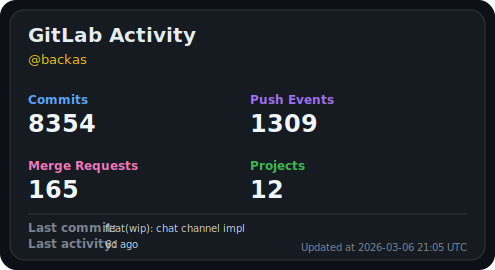

# GitLab Stats Card

Generate a **GitLab stats SVG card** for your **GitHub profile README** using GitHub Actions.

No server required. The SVG is generated directly inside your repository.




## Features

- 📊 GitLab activity stats card
- ⚡ Runs entirely on GitHub Actions
- 🔄 Auto updates via cron schedule
- 🖼 Generates a lightweight SVG
- 🏠 Supports GitLab.com and **self-hosted GitLab**


## Quick Start

### 1️⃣ Add the image to your README
```md

```
⚠️ If you change the `output_path` in the workflow, you must update this image path to match the generated file.

---
### 2️⃣ Add a repository secret

Go to:

```
Repository Settings → Secrets → Actions
```

Add:

```
GITLAB_TOKEN
```

Create a GitLab personal access token with at least:

```
read_api
```
---
### 3️⃣ Create a workflow

Create a file:

```
.github/workflows/gitlab-stats.yml
```

Example workflow:

```yaml
name: Update GitLab Stats

on:
  workflow_dispatch:

  schedule:
    # Change the schedule if you want a different update time
    # This example runs every day at 03:00 UTC
    - cron: "0 3 * * *"

permissions:
  contents: write

jobs:
  update:
    runs-on: ubuntu-latest

    steps:

      - uses: actions/checkout@v4

      - uses: Backas03/gitlab-stats-card@v1
        with:
          # CHANGE THIS to your GitLab username
          gitlab_username: your-gitlab-username

          # Change this only if you use a self-hosted GitLab instance
          gitlab_base_url: https://gitlab.com

          # Change this if you want the SVG stored in a different location
          output_path: assets/gitlab-stats.svg

        env:
          # Create this secret in your repository settings
          GITLAB_TOKEN: ${{ secrets.GITLAB_TOKEN }}

      - name: Commit updated SVG
        run: |
          git add assets/gitlab-stats.svg

          if git diff --cached --quiet; then
            echo "No changes"
            exit 0
          fi

          git config user.name "github-actions[bot]"
          git config user.email "41898282+github-actions[bot]@users.noreply.github.com"

          git commit -m "chore: update GitLab stats card"
          git push
```

---

---

## Inputs

| Name | Required | Default | Description |
|-----|-----|-----|-----|
| `gitlab_username` | yes | — | GitLab username |
| `gitlab_base_url` | no | `https://gitlab.com` | GitLab instance URL |
| `output_path` | no | `assets/gitlab-stats.svg` | Output SVG path |

---

## Environment Variables

| Name | Required | Description |
|-----|-----|-----|
| `GITLAB_TOKEN` | yes | GitLab personal access token |

---

## Example

```yaml
- uses: Backas03/gitlab-stats-card@v1
  with:
    gitlab_username: backas
  env:
    GITLAB_TOKEN: ${{ secrets.GITLAB_TOKEN }}
```

---

## How It Works

```
GitHub Action runs
      ↓
GitLab API queried
      ↓
Activity stats calculated
      ↓
SVG card generated
      ↓
SVG committed to repository
      ↓
README displays the card
```

---

## Notes

- GitLab API limits may affect stats accuracy.
- Commit count is calculated from push events.
- The card updates whenever the workflow runs.

---

## License

MIT License
